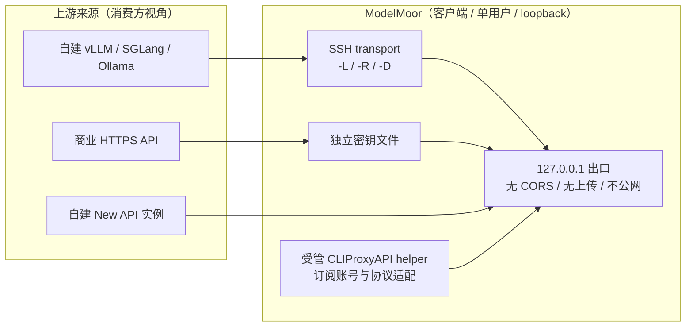

# ModelMoor 定位与竞争边界

更新日期：2026-09-15

本文固定 ModelMoor 的产品意图、与中心化 AI 网关的差异、不可让渡的边界和可直接复用的对外表述。工程里程碑与交付门禁见 [PLAN.md](PLAN.md)；本文只回答“我们是什么、不是什么、以及为什么”。

## 1. 结论摘要

ModelMoor 与 New API、one-api 一类服务端网关属于同一品类名词（“统一 OpenAI 兼容出口”），但在功能面上只重叠约三分之一，在定位上重叠约十分之一。两者服务于相反的意图：

- 那类项目把模型**分发给多个使用者**：多租户、公网服务、渠道池化、计费与账务。
- ModelMoor 把使用者**自己的模型收拢到一台机器**：单用户、loopback、穿越 SSH 边界、凭据留在本机密钥链。

因此两者是**可叠加**关系而非替代关系：一个自建的 New API 实例就是 ModelMoor 的一个普通 `directHTTPS` endpoint，可以把它的模型和其他来源一起收拢到同一个本地出口。

需要主动防守的不是“被替代”，而是**被误读**：一旦 ModelMoor 被读成“轻量版 one-api”，它最有价值的部分（本地优先、凭据隔离、边界穿越、失败即阻断）就会被当成缺失的 Enterprise 功能来审视。

## 2. 对照基线：New API / one-api 类中心化网关

| | ModelMoor | New API |
| --- | --- | --- |
| 形态 | macOS 菜单栏 App + CLI + TUI | 服务端 daemon（Go）+ Web 控制台 |
| 部署 | 单机、进程内 library、无 daemon | Docker / Compose / 集群 + 反向代理 |
| 侦听 | 硬编码 `127.0.0.1`，不支持 GatewayPorts | 公网或 LAN HTTP 服务 |
| 规模参照 | Swift 78 文件 / 约 26,400 行 | 48.1k stars、305 贡献者、524 releases |
| 持久化 | JSON + `flock` + revision CAS（schema v3） | SQLite / MySQL / PostgreSQL + Redis |
| 许可 | MIT | AGPLv3（+ 商业授权） |
| 核心隐喻 | 插座：跨 SSH 边界搬运 API | 枢纽：中心化聚合与分发 |

叠加使用时的关系：

反向不成立：New API 无法提供 SSH 隧道生命周期、独立密钥文件、菜单栏应用，或把本地出口反向推送到远端服务器（`ssh -R`）的能力。

## 3. 重叠度分层

| 能力层 | 重叠度 | 说明 |
| --- | --- | --- |
| 品类名词“AI 网关 / API 聚合” | 高 | 同一句话可以同时描述两者 |
| 对外契约 `/v1/models`、`/v1/chat/completions`、`sk-` bearer、SSE | 高 | 都是 OpenAI 兼容透明转发 |
| 模型别名映射 | 较高 | `publicModel → upstreamModel` 对应渠道模型表 |
| 多来源聚合（自建 + 商业 API） | 中 | 上游近期新增 vllm/sglang channel，进一步靠近 |
| 用量统计 | 中 | 都基于上游 `usage` 字段 |
| 配额与成本 | 低 | 本机估算 + 硬阻断，对比充值、分摊、缓存倍率计费 |
| 协议转换（Claude / Gemini / Responses / Realtime / Rerank） | 低 | 进程内 Gateway 只接受 OpenAI 兼容端点 |
| 路由策略 | 极低 | 精确 1:1，不做 fallback / 负载均衡 / 重试 / 权重 |
| 多租户与账号体系 | 无 | Gateway 鉴权只返回布尔结果，无身份与角色 |
| 部署与运维面 | 无 | loopback 进程内 App，对比容器编排与集群 |
| 可观测性与审计 | 低 | 无 access log、无 metrics，只有脱敏生命周期诊断 |
| SSH 隧道作为一等 transport | 无 | 对方完全没有此概念 |

## 4. 边界与决策记录

三条边界不可让渡。侵入任一条都需要先修改本文并说明理由，而不是直接进入里程碑。

### 边界一：侦听面

Unified API 永远只绑定 `127.0.0.1`。不提供公网或局域网监听、GatewayPorts、反向代理、集群部署，也不引入浏览器 CORS。

理由：本机攻击面是核心卖点，暴露一次即永久失去该卖点。后果：需要公网分发的用户应在前置自建网关，ModelMoor 只作为其客户端。

### 边界二：身份面

Gateway 只做 bearer 凭据校验，不产生用户、组织、角色、per-key 配额或用量归属。本地 API key 表达访问控制，不是计费主体。

理由：身份体系会立刻引入用户管理、权限模型和持久化 schema，把单机应用变成需要运维的服务。后果：多人共享只能通过“各自的本机实例”实现，不支持团队共用一台 ModelMoor。

### 边界三：协议面

进程内 Gateway 只接受 `kind == .openAICompatible` 端点并透明转发，不做 OpenAI 与 Anthropic、Gemini 之间的语义转换。订阅账号的协议适配由受管 CLIProxyAPI helper 承担，该能力不计入 ModelMoor 的对外承诺。

理由：语义转换是一个持续追赶上游的长期维护面，且订阅账号适配涉及各服务商条款，不应与核心转发路径绑定在同一承诺层级。后果：原生 Claude 或 Gemini 协议客户端需要经由 helper 转换后才能接入。

## 5. 风险项与处置

| 风险 | 表现 | 处置 |
| --- | --- | --- |
| Per-model budgets 被读成账务系统 | 被当作“轻量版 one-api”审视，随后被追问账单、支付、分摊与发票 | 在所有对外文案中保持“本机估算 + fail-closed 硬阻断”的措辞，明确不推断缓存折扣、不产出账单、不做预付预留；不引入支付通道 |
| 协议转换归属含混 | 用户以为 ModelMoor 承诺 Claude 或 Gemini 兼容 | 表述为“经受管 helper 接入的订阅账号适配”，不写成 Gateway 能力；不承诺格式转换的正确性或完整性 |
| 主标语落在重叠区 | “Many APIs. One local endpoint.” 强调聚合，容易被归入网关品类 | 保留主标语，但在同一屏内补一句边界声明，把差异点前移（见下节） |
| 文档与代码漂移 | 规划文档曾以 `0.1.0`、schema v2 和旧名称 “Local Gateway” 描述当前代码 | 与 README、`docs/index.html` 一并复核；命名统一为 Unified API；版本、schema、功能名以代码为准并纳入发布前检查清单 |

## 6. 对外表述基线

### 6.1 一句话与一段话

- 一句话：ModelMoor 把你自己机器上的模型收拢成一个只在本机可用的 OpenAI 兼容端点，并负责穿越 SSH 边界。
- 一段话：ModelMoor 是一个原生 macOS 菜单栏应用、CLI 和 TUI，用于把远端自托管 API 与商业 HTTPS API 收拢到固定的 `127.0.0.1` 出口，或把这个出口反向推送到远端服务器。它面向单用户与单机，凭据只进入系统密钥链，不做多租户、账务、公网监听或协议语义转换。

### 6.2 可复用的英文文案

主标语（保留）：

> Many APIs. One local endpoint.

差异化补充句（建议加入首屏）：

> Local-first and single-user. ModelMoor crosses SSH boundaries instead of serving the internet: one loopback endpoint, credentials in an owner-only secrets file, and no telemetry, accounts, or public listener.

何时不该说（明确避免）：

- 不要使用 aggregation、distribution、platform、enterprise、multi-tenant、team sharing、billing、top-up、channel、load balancing、failover 一类词汇。
- 不要把 Unified API 描述为 gateway-as-a-service、云服务或需要部署的组件。
- 不要声称原生支持 Claude 或 Gemini 协议；只描述为经受管 helper 接入的订阅账号适配。
- 不要把 per-model budgets 称为 quota、billing 或 accounting；使用 local limits、fail-closed、not an invoice、estimate at configured prices。

应当强调：

- local-first、single-user、loopback-only、private by construction。
- across the SSH boundary、`ssh -L`、`ssh -R`，以及两端方向都可用的能力。
- credential isolation、one secret per endpoint、owner-only secrets file、secrets never in configuration files。
- fail-closed budgets、no telemetry、no cloud account、no inference content collected。

## 7. 维护约定

- 改动 README、`docs/index.html` 或发布说明前，先核对本文第 4 节的三条边界与第 6 节的用词清单。
- 任何新增能力若触及侦听面、身份面或协议面，先更新本文再进入 [PLAN.md](PLAN.md) 的里程碑。
- 每完成一个里程碑，复核本文第 2 节的对照表是否仍与上游项目实际能力相符。
- 复核触发条件：用户明确提出多人共享需求；上游类项目新增本地优先的桌面形态；ModelMoor 引入任何需要长期服务的组件。
